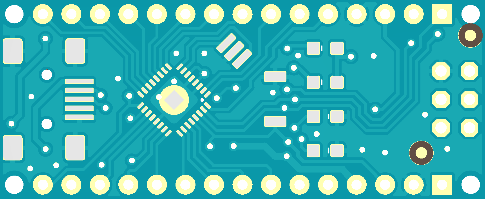
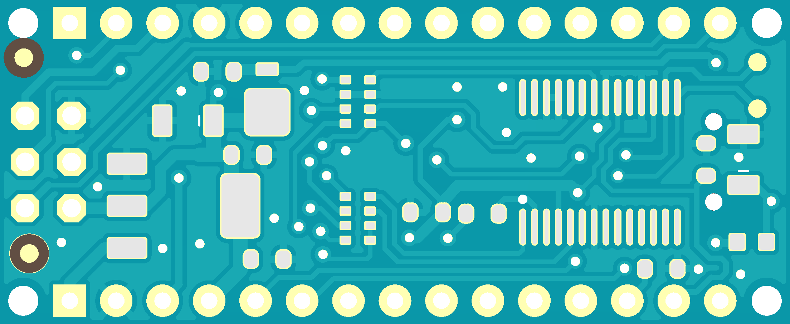
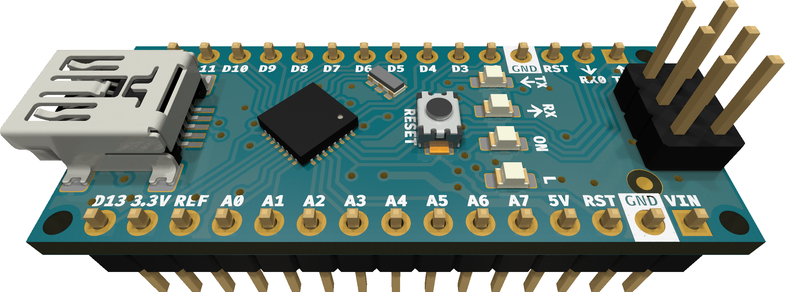

# Nano_KiCAD

KiCAD porting of Arduino Nano V3.3 PCB design.

The original project was made for EAGLE v7. The schematic, PCB and some of the symbols/footprints are slightly modified to avoid ERC/DRC errors/warnings.

## Acknowledgement

The original project was downloaded from [Arduino Official Store](https://store.arduino.cc/products/arduino-nano).

3D models in the [NanoV3.3.3dshapes](NanoV3.3.3dshapes) directory are works of others.

| File | Source |
| ---- | ------ |
| DO-220AA.stp | https://componentsearchengine.com/part-view/SS1P3L-M3%2F84A/Vishay |
| SW_SPST_3.9x2.9mm.wrl | https://lceda.cn |
| Others | https://gitlab.com/kicad/libraries/kicad-packages3D |

## Preview

Front:

Back:

Assembled:

